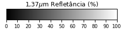

# cmap2png
Useful script to convert a color map definition to PNG image file.

## Usage
```
cmap2png.py [-h] cmapType cmapId min max tick label output

positional arguments:
  cmapType    Colormap type: [cpt, h2g or matplotlib]
  cmapId      Colormap identifier or path to colormap file
  min         Legend minimum value
  max         Legend maximum value
  tick        Legend tick frequency
  label       Legend label
  output      Result output path

optional arguments:
  -h, --help  show this help message and exit
```
 
 ## Examples
```bash
cmap2png.py matplotlib Greys -55.0 72.0 10.0 "Brightness Temperature ($^{\circ}$C)" legend-celsius-en.png
```
```bash
cmap2png.py cpt WVCOLOR35.cpt -100.0 100.0 20.0 "My awesome label" legend.png
```

                                                    
                                               
                                               
                                               
                                               
                                               
                                               
                                           
                                           
                                 
                                           
                                 
                                           
                                 
                                           
                                           
                                           
                                       
                                 
                                           
                                           
                                           
                                                 
                                                            
